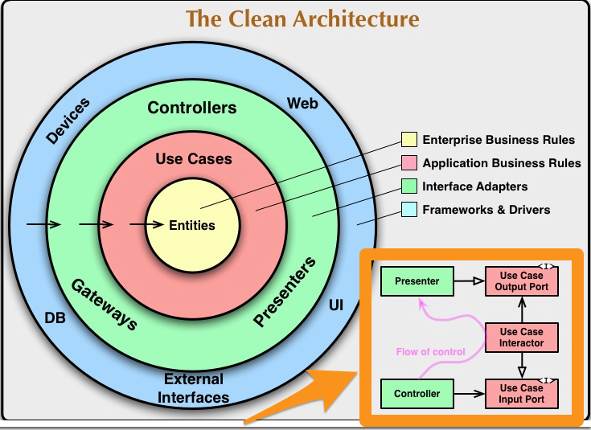
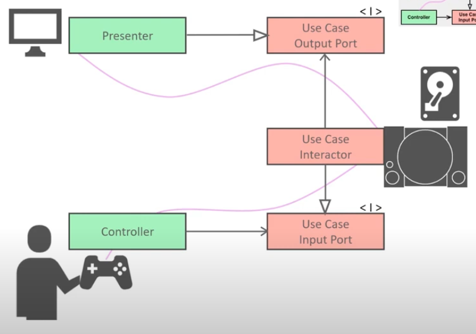

# 🛤 Frontend simple TODO app with clean architecture

## 🙄 How to run this app
```
$ yarn install
$ yarn start
```

## 🏗 Architecture in this app
### directories
| name        | explanation                                                                                                                                            |
|-------------|--------------------------------------------------------------------------------------------------------------------------------------------------------|
| components/ | Store presentation(view, UI) layer. Should be organize with atomic design for example, but later.                                                      |
| domain/     | Store domain layer. Entities and repository looks they should be in data directory, but in order to dependency inversion, they depends on domain layer |
| data/       | Store data layor (repository and data)                                                                                                                 |
| di/         | Store Dependency Injection codes                                                                                                                       |

### Layers


## 🤔 What is clean architecture?
I'm not gonna here explain deeply, but as you can see clean architecture is similar to game structure  
▼ [From this youtube video](https://www.youtube.com/watch?v=BvzjpAe3d4g)  


And this is famous architecture image, eyes automatically focus on big circle image, but right bottom image is also important


You can easily see architecture flow with that gaming image


### ⭐ About Presenter in frontend
It was difficult how to handle with **presenter** in frontend architecture, because frontend is UI itself

## 😎 Connection with SOLID principle
After enjoying Clean Architecture, I thought there are two important things in it.
```
1. separate of concerns
2. control dependency direction by using interface
```
Now let's think about number **2**  
If you have learned SOLID principle, would remind you of Dependency Inversion  
[I explained about Dependency Inversion with image](https://dev.to/kaziusan/solid-dependency-inversion-399h)

(Clean architecture and SOLID principle are written by same person, Robert C. Martin.)

## 🗒 TODO
- remove data button (local storage)

## 💡 References
[youtube in Japanese](https://www.youtube.com/watch?v=BvzjpAe3d4g)  
  easiest way to understand what is clean architecture if you understand Japanese

[react with clean architecture, github source code](https://github.com/falsy/react-with-clean-architecture)  
  I think this code is more real world code than mine, you even could get how to handle with web and mobile by using **adapter**

